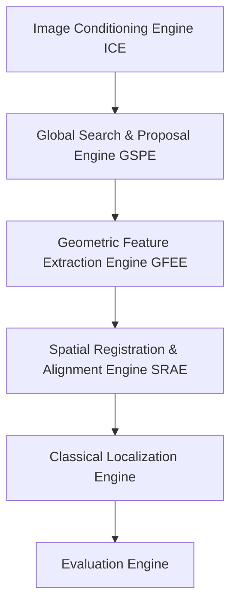

# Drift-Sense V2 Execution Flow

```mermaid
graph TD
    A[Image Conditioning Engine ICE] --> B[Global Search & Proposal Engine GSPE]
    B --> C[Geometric Feature Extraction Engine GFEE]
    C --> D[Spatial Registration & Alignment Engine SRAE]
    D --> E[Classical Localization Engine]
    E --> F[Evaluation Engine]
```
